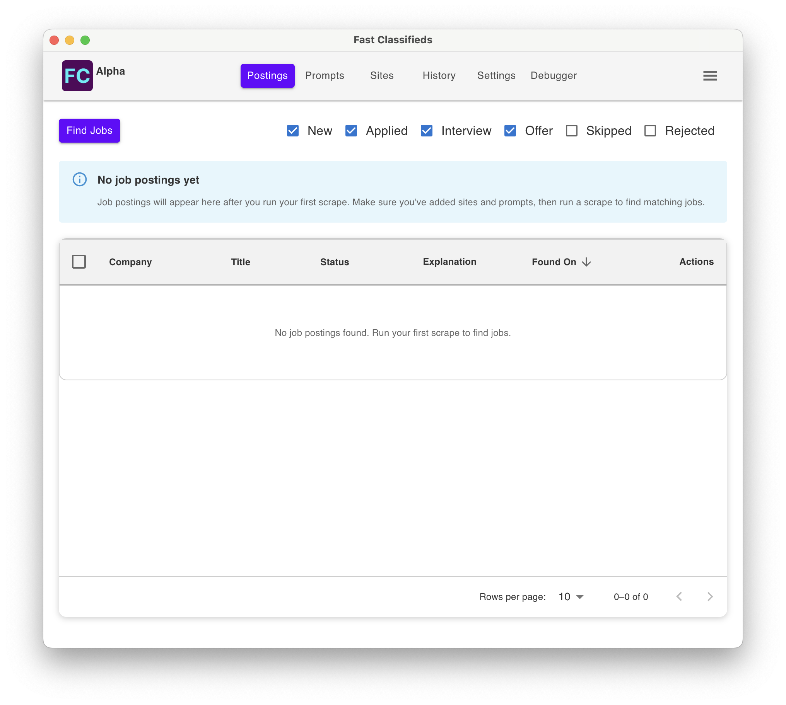

# Fast Classifieds - Browse company job boards quickly.

Stop wasting hours manually browsing company career pages. Fast Classifieds uses AI to automatically scan multiple company websites, find relevant job postings, and explain why each opportunity matches your criteria. Keep your job search organized in one desktop application. No accounts, no subscriptions, your data stays local.

[Learn more on the marketing website.](https://travisbumgarner.dev/marketing/classifieds)

## Local Development

1. `npm run bootstrap` - Install dependencies and setup database.
1. Running App
   - Everywhere: `npm run dev`
   - Within VSCode: Use the `Run and Debug` tab, select `Main + renderer` from dropdown, then click run.
1. Note - Electron's main, the backend, does not have hot module reloading.
   - Everywhere: Restart the `npm run dev` script
   - Within VSCode: Hit the `Restart` button.

## Builds

Mac builds are done from my own computer. Windows and Linux are handled by GitHub Actions. 